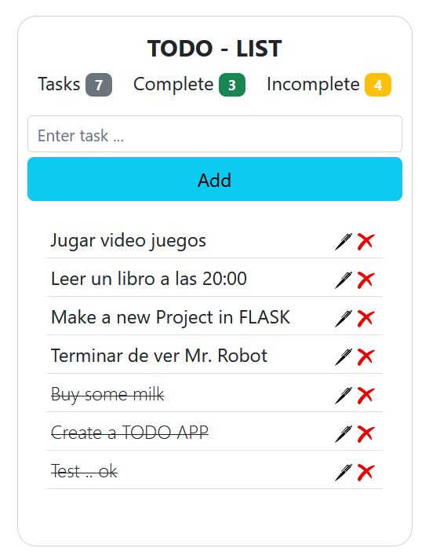

<div style="text-align: center">

## To Do List

</div>

### Clone the repository

```
git clone https://github.com/alanrc/TodoApp-Django.git
```

### Move into the directory where we have the file

```
cd TodoApp-Django
```

### Create and activate the virtual environment

```
# Create the virtualenv environment
python -m venv env

# Activate the virtual environment
source env/Script/activate
```

### Install the requirements

```
pip install -r requirements.txt
```

### Running the App

```
python manage.py runserver
```

> Starting development server at http://127.0.0.1:8000/

### App Preview


